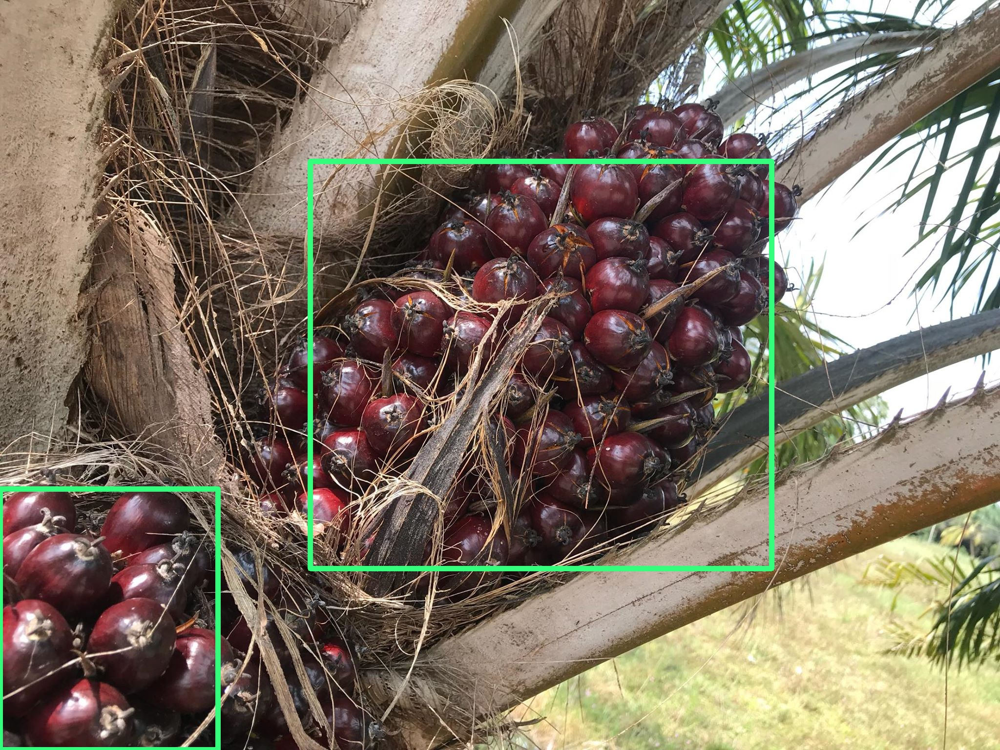
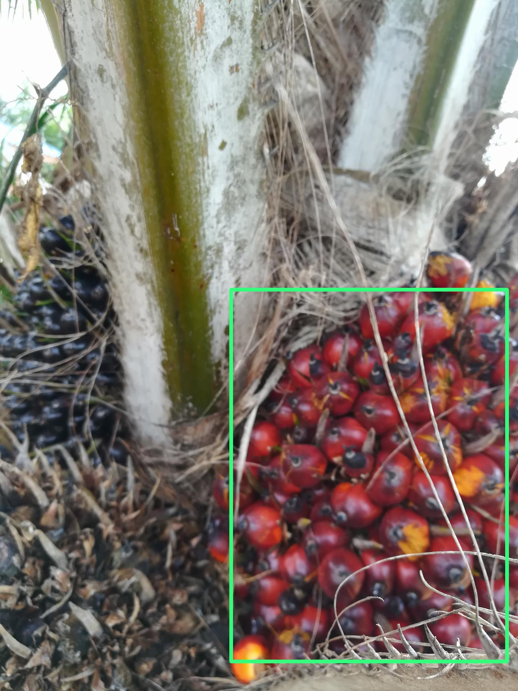

# Watering Bot (aka. SMART ROBOT v.1)

Main objective:

* Watering by following GPS marker
* Palm tree analysis for find disease 
* Loadcell
* Measure soil & humidity

### Watering

The robot can navigate autonomously point-by-point by GPS receiver and data from the onboard computer.
The GPS point also can be edit in GUI and send to the robot via MQTT protocol

### Palm tree analysis

Capture pictures of oil palm leaf and detect Oil palm fruits using computer vision and deep learning to determined quality of palm fruit and leaf to prevent disease.\
Picture example 1:
 > 
Picture example 2:
 > 

### Loadcell

loadcell built-in with watering-robot

### Measure soil & humidity

Measure soil humidity, temperature, and air humidity. Collect the data from the robot and send to Firebase for further analysis.  

## Usage

Clone this repository and run ```sudo ./robot.sh``` the program will start and install and update all requires packages. Make sure you have all the packages installed. After that program will ask you how to control the robot.

## License

Watering_robot is under license [MIT](https://github.com/kanokkorn/watering_robot/blob/master/LICENSE)
